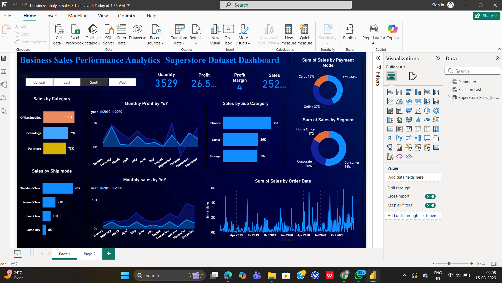

# 📊 Business Sales Performance Analytics – Superstore Dataset Dashboard

## FUTURE_DS_TASK01
Analyzed business sales data using Power BI to uncover revenue trends, identify top-selling products, evaluate high-performing categories, and assess regional sales performance.  
The interactive dashboard provides clear insights to support **data-driven decision making and business strategy**.

---

## 📌 Project Overview
This project was completed as part of the **Future Interns Data Science & Analytics Internship (DS Track)**.

The objective of this project is to analyze retail sales data from the **Superstore dataset** and transform raw data into meaningful insights using an **interactive Power BI dashboard**.

The dashboard helps identify sales trends, top-performing products, customer segments, and regional performance to support business decision-making.

---

## 🚀 Business Questions Addressed
• Which product categories generate the highest revenue?  
• What are the top-selling products?  
• How do sales and profits change over time?  
• Which regions contribute the most to overall sales?  
• Which customer segments generate the highest revenue?  

---

## 🛠 Tools Used
- Power BI  
- Excel  

---

## 📊 Dashboard Features
- KPI Cards (Sales, Profit, Quantity, Profit Margin)
- Sales by Category Analysis
- Sales by Sub-Category
- Monthly Sales & Profit Trends
- Customer Segment Analysis
- Payment Mode Analysis
- Shipping Mode Analysis
- Interactive Region Filter

---

## 🔍 Key Insights
- Office Supplies category generated the highest sales.
- Phones are the top-selling sub-category.
- Consumer segment contributes the largest share of sales.
- COD is the most used payment mode.
- Sales show increasing trends across months.

---

## 💡 Skills Demonstrated
- Data Analysis  
- Data Visualization  
- Dashboard Design  
- Business Analytics  
- Insight Generation  

---

## 🖼 Dashboard Preview

---

## 🚀 Conclusion
This project demonstrates how business sales data can be analyzed using Power BI to generate meaningful insights and support data-driven business decisions.
